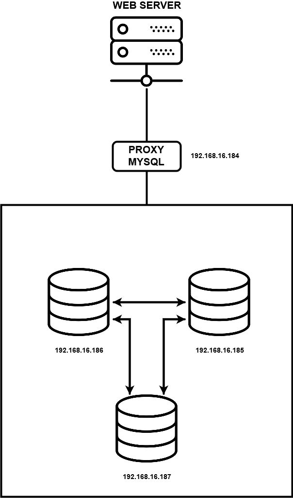

Muhammad Aufa Wibowo
05111640000184
# Multi Master Replication
## Outline
- [Multi Master Replication](#multi-master-replication)
  - [Outline](#outline)
    - [1. Desain Infrastruktur](#1-desain-infrastruktur)
      - [1.1 Gambar Infrastruktur](#11-gambar-infrastruktur)
      - [1.2 Detil Server](#12-detil-server)
      - [1.3 Pembagian IP](#13-pembagian-ip)
      - [1.4 Spesifikasi Server](#14-spesifikasi-server)
    - [2. Implementasi](#2-implementasi)
      - [1. Menginstall OS dan MySQL](#1-menginstall-os-dan-mysql)
      - [2. Konfigurasi OS dan MySQL dasar](#2-konfigurasi-os-dan-mysql-dasar)
      - [3. Mengeluarkan `uuidgen`](#3-mengeluarkan-uuidgen)
      - [4. Membuat Group Replication didalam file konfigurasi MySQL](#4-membuat-group-replication-didalam-file-konfigurasi-mysql)
      - [5. Restart Seluruh Server Database MySQL](#5-restart-seluruh-server-database-mysql)
      - [6. Membuat Pengguna Replikasi dan Mengaktifkan Plugin Group Replication](#6-membuat-pengguna-replikasi-dan-mengaktifkan-plugin-group-replication)
      - [7. Memulai Group Replication](#7-memulai-group-replication)
      - [8. Menginstall dan Mengkonfigurasi Load Balancer](#8-menginstall-dan-mengkonfigurasi-load-balancer)
    - [3. Implementasi Aplikasi Tambahan Kedalam Sistem](#3-implementasi-aplikasi-tambahan-kedalam-sistem)
    - [4. Simulasi Fail-Over](#4-simulasi-fail-over)

###  1. Desain Infrastruktur
#### 1.1 Gambar Infrastruktur

#### 1.2 Detil Server
1. Server database sejumlah tiga buah
2. Proxy sejumlah satu buah
3. Web Server sebanyak satu buah
#### 1.3 Pembagian IP
1. Server Database
   1. 192.168.16.185
   2. 192.168.16.186
   3. 192.168.16.187
2. Proxy: 192.168.16.184
3. Web Server: 192.168.16.188
#### 1.4 Spesifikasi Server
   1. Server Database
       - OS menggunakan `bento/ubuntu-16.04`
       - RAM 512MB
   2. Proxy
       - OS enggunakan `bento/ubuntu-16.04`
       - RAM 512MB
   3. Apache Web server
       - OS menguunakan `ubuntu/xenial64`
       - RAM 1024MB
### 2. Implementasi 
Seluruh tahapan yang ada didalam segmen implementasi ini hanya berlaku didalam environment vagrant.
#### 1. Menginstall OS dan MySQL
   1. Install OS
   2. Install MySQL 

Hasil terjemahan untuk file perintah automasi didalam vagrant
```shell
# Changing the APT sources.list to kambing.ui.ac.id
sudo cp '/vagrant/sources.list' '/etc/apt/sources.list'

# Updating the repo with the new sources
sudo apt-get update -y

# Install required library
sudo apt-get install libaio1
sudo apt-get install libmecab2

# Get MySQL binaries
curl -OL https://dev.mysql.com/get/Downloads/MySQL-5.7/mysql-common_5.7.23-1ubuntu16.04_amd64.deb
curl -OL https://dev.mysql.com/get/Downloads/MySQL-5.7/mysql-community-client_5.7.23-1ubuntu16.04_amd64.deb
curl -OL https://dev.mysql.com/get/Downloads/MySQL-5.7/mysql-client_5.7.23-1ubuntu16.04_amd64.deb
curl -OL https://dev.mysql.com/get/Downloads/MySQL-5.7/mysql-community-server_5.7.23-1ubuntu16.04_amd64.deb

# Setting input for installation
sudo debconf-set-selections <<< 'mysql-community-server mysql-community-server/root-pass password admin'
sudo debconf-set-selections <<< 'mysql-community-server mysql-community-server/re-root-pass password admin'

# Install MySQL Community Server
sudo dpkg -i mysql-common_5.7.23-1ubuntu16.04_amd64.deb
sudo dpkg -i mysql-community-client_5.7.23-1ubuntu16.04_amd64.deb
sudo dpkg -i mysql-client_5.7.23-1ubuntu16.04_amd64.deb
sudo dpkg -i mysql-community-server_5.7.23-1ubuntu16.04_amd64.deb
```
#### 2. Konfigurasi OS dan MySQL dasar
1. Konfigurasi OS
2. Konfigurasi MySQL
    Set password untuk MySQL
    ```shell
    sudo debconf-set-selections <<< 'mysql-community-server mysql-community-server/root-pass password admin'
    sudo debconf-set-selections <<< 'mysql-community-server mysql-community-server/re-root-pass password admin'
    ```
    Dalam file konfigurasi MySQL, kami mengonfigurasi layanan untuk mendengarkan koneksi eksternal pada port default 3306. Kami juga mendefinisikan 33061 sebagai port yang harus digunakan anggota untuk koordinasi replikasi.
    Kita perlu membuka akses ke dua port ini di firewall kita.
    ```shell
    sudo ufw allow 33061
    sudo ufw allow 3306
    ```
#### 3. Mengeluarkan `uuidgen` 
ketik `uuidgen` pada terminal UNIX (dalam hal ini, menggunakan ubuntu).
```
> uuidgen
```
output
```
keluaran_uuid
```
#### 4. Membuat Group Replication didalam file konfigurasi MySQL
Proses automasi untuk konfigurasi group replication MySQL akan disimpan dalam `my{angka}.cnf`. Berikut adalah tahapan menulis perintah-perintah yang ada didalam file tersebut.
1. Konfigurasi umum group replication
    Bagian berikut mengandung konfigurasi umum untuk group replication. Pengaturan ini mengaktifkan ID transaksi global, mengkonfigurasi pencatatan biner yang diperlukan untuk replikasi grup, dan mengkonfigurasi SSL untuk grup. Konfigurasi ini juga mengatur beberapa item lain yang membantu dalam pemulihan dan bootstrap.
    ```shell
    # General replication settings
    gtid_mode = ON
    enforce_gtid_consistency = ON
    master_info_repository = TABLE
    relay_log_info_repository = TABLE
    binlog_checksum = NONE
    log_slave_updates = ON
    log_bin = binlog
    binlog_format = ROW
    transaction_write_set_extraction = XXHASH64
    loose-group_replication_bootstrap_group = OFF
    loose-group_replication_start_on_boot = OFF
    loose-group_replication_ssl_mode = REQUIRED
    loose-group_replication_recovery_use_ssl = 1
    ```
2. Konfigurasi shared group replication
    `loose-group_replication_group_name` adalah UUID yang sudah dihasilkan tadi. `loose-group_replication_ip_whitelist` adalah daftar alamat IP server MySQL. `loose-group_replication_group_seeds` berisi hal yang sama dengan sebelumnya namun diisi oleh port yang akan digunakan oleh setiap alamat IP. 
    ```shell
    # Shared replication group configuration
    loose-group_replication_group_name = "keluaran_uuid"
    loose-group_replication_ip_whitelist = "192.168.16.185, 192.168.16.186, 192.168.16.187"
    loose-group_replication_group_seeds = "192.168.16.185:33061, 192.168.16.186:33061, 192.168.16.187:33061"
    ```
3. Konfigurasi untuk Multi-Primary 
    Menambahkan `loose-group_replication_single_primary_mode` dan `loose-group_replication_enforce_update_everywhere_checks` dengan parameter berikut.
    ```shell
    # Single or Multi-primary mode? Uncomment these two lines
    # for multi-primary mode, where any host can accept writes
    loose-group_replication_single_primary_mode = OFF
    loose-group_replication_enforce_update_everywhere_checks = ON
    ```
4. Konfigurasi untuk setiap host
   

   ```shell
    # Host specific replication configuration
    server_id = 11
    bind-address = "192.168.16.185"
    report_host = "192.168.16.185"
    loose-group_replication_local_address = "192.168.16.185:33061"
   ```
    Hasil terjemahan untuk file perintah automasi didalam vagrant
    [my185.cnf](https://github.com/aufawibowo/multi-master-replication/blob/master/my185.cnf);
    [my186.cnf](https://github.com/aufawibowo/multi-master-replication/blob/master/my186.cnf);
    [my187.cnf](https://github.com/aufawibowo/multi-master-replication/blob/master/my187.cnf);

5. Copy file-file `.cnf` tadi kedalam vagrant box yang akan digunakan
   Tambahkan perintah
   ```shell
    # Copy MySQL configurations
    sudo cp /vagrant/my{angka}.cnf /etc/mysql/my.cnf
   ```
   disetiap akhir file deployMYSQL{angka}.sh
    
#### 5. Restart Seluruh Server Database MySQL
Tambahkan perintah
```shell
# Restart MySQL services
sudo service mysql restart
```
disetiap akhir file deployMYSQL{angka}.sh

Hasil akhir file `deployMYSQL{angka}.sh` adalah seperti berikut
[deployMYSQL185.sh](https://github.com/aufawibowo/multi-master-replication/blob/master/deployMYSQL185.sh);
[deployMYSQL186.sh](https://github.com/aufawibowo/multi-master-replication/blob/master/deployMYSQL186.sh);
[deployMYSQL187.sh](https://github.com/aufawibowo/multi-master-replication/blob/master/deployMYSQL187.sh);

#### 6. Membuat Pengguna Replikasi dan Mengaktifkan Plugin Group Replication 
Untuk mengatur konfigurasi setiap database, harus dilakukan login terlebih dahulu kedalam masing-masing database dengan cara berikut.
```shell
mysql -u root -p
```
Pengguna repiklasi diperlukan di setiap server untuk membuat replikasi grup. Karena setiap server akan memiliki pengguna replikasi sendiri, kita perlu mematikan binary logging selama proses pembuatan. Jika tidak, setelah replikasi dimulai, grup akan mencoba untuk menyebarkan pengguna replikasi dari server utama ke server lain, menciptakan konflik dengan pengguna replikasi yang sudah ada.
```sql
mysql> -- basic
mysql> SET SQL_LOG_BIN=0;
mysql> CREATE USER 'repl'@'%' IDENTIFIED BY 'password' REQUIRE SSL;
mysql> GRANT REPLICATION SLAVE ON *.* TO 'repl'@'%';
mysql> FLUSH PRIVILEGES;
mysql> SET SQL_LOG_BIN=1;
```
Selanjutnya, kita perlu mengatur saluran `group_replication_recovery` untuk menggunakan pengguna replikasi baru dan kata sandi yang terkait. Setiap server kemudian akan menggunakan kredensial ini untuk mengautentikasi ke grup.
```sql
mysql> CHANGE MASTER TO MASTER_USER='repl', MASTER_PASSWORD='password' FOR CHANNEL 'group_replication_recovery';
```
Dengan adanya pengguna replikasi, kita dapat mengaktifkan plugin replikasi grup untuk mempersiapkan inisialisasi grup. Karena kita menggunakan versi terbaru MySQL, kita dapat mengaktifkan plugin dengan memasukkan:
```sql
mysql> INSTALL PLUGIN group_replication SONAME 'group_replication.so';
```
Hasil akhir [cluster_member.sql](https://github.com/aufawibowo/multi-master-replication/blob/master/cluster_member.sql);
#### 7. Memulai Group Replication
Sekarang setiap server MySQL memiliki pengguna replikasi yang dikonfigurasi dan plugin replikasi grup diaktifkan, kita dapat memulai untuk dimunculkan digrup kita.
1. Bootstrap node pertama
    Anggota grup bergantung pada anggota yang ada untuk mengirim data replikasi, daftar anggota terbaru, dan informasi lainnya ketika awal bergabung dengan grup. Oleh karena itu, kita perlu menggunakan prosedur yang sedikit berbeda untuk memulai anggota grup awal sehingga mengetahui tidak mengharapkan informasi ini dari anggota lain dalam daftar benihnya.
    Jika disetel, variabel `group_replication_bootstrap_group` memberi tahu anggota bahwa ia seharusnya tidak mengharapkan untuk menerima informasi dari teman sebaya dan sebaliknya harus membuat grup baru dan memilih sendiri anggota utama. Karena satu-satunya situasi di mana ini sesuai adalah ketika tidak ada anggota grup yang ada, kami akan mematikan fungsi ini segera setelah bootstrap grup:
    ```sql
    vagrant@db185 mysql> SET GLOBAL group_replication_bootstrap_group=ON;
    vagrant@db185 mysql> START GROUP_REPLICATION;
    vagrant@db185 mysql> SET GLOBAL group_replication_bootstrap_group=OFF;
    ```
    Grup harus dimulai dengan server ini sebagai satu-satunya anggota. Kita dapat memverifikasi ini dengan memeriksa entri dalam tabel `replication_group_members` di database `performance_schema`:
    ```sql
    vagrant@db185 mysql> SELECT * FROM performance_schema.replication_group_members;
    ```
2. Memulai node yang tersisa
    Selanjutnya, pada server `db2` dan `db3` dalam kasus ini (bisa lebih dari satu), mulai replikasi grup. Karena kita sudah memiliki anggota aktif, kita tidak perlu mem-bootstrap grup dan cukup bergabung dengan cara:
    ```sql
    vagrant@db186 mysql> START GROUP_REPLICATION;
    ```
    ```sql
    vagrant@db187 mysql> START GROUP_REPLICATION;
    ```
3. Cek apakah anggota sudah tergabung pada grup
    ```sql
    vagrant@db186 mysql> SELECT * FROM performance_schema.replication_group_members;
    ```
    ```sql
    vagrant@db187 mysql> SELECT * FROM performance_schema.replication_group_members;
    ```
#### 8. Menginstall dan Mengkonfigurasi Load Balancer
Load balancer ini menggunakan ProxySQL
1. Download ProxySQL dan install dengan perintah
   ```shell
    #download
    curl -OL https://github.com/sysown/proxysql/releases/download/v1.4.4/proxysql_1.4.4-ubuntu16_amd64.deb
    curl -OL https://dev.mysql.com/get/Downloads/MySQL-5.7/mysql-common_5.7.23-1ubuntu16.04_amd64.deb
    curl -OL https://dev.mysql.com/get/Downloads/MySQL-5.7/mysql-community-client_5.7.23-1ubuntu16.04_amd64.deb
    curl -OL https://dev.mysql.com/get/Downloads/MySQL-5.7/mysql-client_5.7.23-1ubuntu16.04_amd64.deb

    #install
    sudo dpkg -i proxysql_1.4.4-ubuntu16_amd64.deb
    sudo dpkg -i mysql-common_5.7.23-1ubuntu16.04_amd64.deb
    sudo dpkg -i mysql-community-client_5.7.23-1ubuntu16.04_amd64.deb
    sudo dpkg -i mysql-client_5.7.23-1ubuntu16.04_amd64.deb
   ```
2. Mengatur firewall
   ```shell
    sudo ufw allow 33061
    sudo ufw allow 3306
   ```
3. Memulai ProxySQL
   ```shell
   sudo systemctl start proxysql
   ```
4. Mengkonfigurasi MySQL member agar ProxySQL untuk group replication berjalan
    ```shell
    vagrant@db186:~$ mysql -u root -p < addition_to_sys.sql
    vagrant@db186:~$ mysql -u root -p
    vagrant@db186 mysql> CREATE USER 'monitor'@'%' IDENTIFIED BY 'monitorpassword';
    vagrant@db186 mysql> GRANT SELECT on sys.* to 'monitor'@'%';
    vagrant@db186 mysql> FLUSH PRIVILEGES;
    ```
5. Menambahkan akun monitoring
   ```shell
   mysql -u admin -p -h 127.0.0.1 -P 6032 --prompt='ProxySQLAdmin>
   ```
   ```shell
    ProxySQLAdmin> UPDATE global_variables SET variable_value='monitor' WHERE variable_name='mysql-monitor_username';
    ProxySQLAdmin> UPDATE global_variables SET variable_value='monitorpassword' WHERE variable_name='mysql-monitor_password';
    ProxySQLAdmin> LOAD MYSQL VARIABLES TO RUNTIME;
    ProxySQLAdmin> SAVE MYSQL VARIABLES TO DISK;
   ```
6. Menambahkan MySQL member ke ProxySQL Server Pool
    ```shell
    ProxySQLAdmin> INSERT INTO mysql_group_replication_hostgroups (writer_hostgroup, backup_writer_hostgroup, reader_hostgroup, offline_hostgroup, active, max_writers, writer_is_also_reader, max_transactions_behind) VALUES (2, 4, 3, 1, 1, 3, 1, 100);
    ```
    ```shell
    ProxySQLAdmin> INSERT INTO mysql_servers(hostgroup_id, hostname, port) VALUES (2, '192.168.16.185', 3306);
    ProxySQLAdmin> INSERT INTO mysql_servers(hostgroup_id, hostname, port) VALUES (2, '192.168.16.186', 3306);
    ProxySQLAdmin> INSERT INTO mysql_servers(hostgroup_id, hostname, port) VALUES (2, '192.168.16.187', 3306);
    ```
    ```shell
    ProxySQLAdmin> LOAD MYSQL SERVERS TO RUNTIME;
    ProxySQLAdmin> SAVE MYSQL SERVERS TO DISK;
    ```
7. Membuat user untuk digunakan oleh ProxySQL
   ```shell
   vagrant@db185:~$ mysql -u root -p
   ```
   ```shell
    vagrant@db186 mysql> CREATE USER 'bloguser'@'%' IDENTIFIED BY 'password';
    vagrant@db186 mysql> CREATE DATABASE blog;
    vagrant@db186 mysql> GRANT ALL PRIVILEGES on blog.* to 'bloguser'@'%';
    vagrant@db186 mysql> FLUSH PRIVILEGES;
   ```
   ```shell
   mysql -u admin -p -h 127.0.0.1 -P 6032 --prompt='ProxySQLAdmin> '
   ```
   ```shell
    ProxySQLAdmin> INSERT INTO mysql_users(username, password, default_hostgroup) VALUES ('bloguser', 'password', 2);
    ProxySQLAdmin> LOAD MYSQL USERS TO RUNTIME;
    ProxySQLAdmin> SAVE MYSQL USERS TO DISK;
   ```
### 3. Implementasi Aplikasi Tambahan Kedalam Sistem
Berikut adalah tambahan aplikasi server API yang terhubung dengan mysql
1. Instal apache dan php
    ```shell
    #apache
    sudo apt-get update
    sudo apt-get install apache2

    sudo nano /etc/apache2/apache2.conf
    server_domain_or_IP

    sudo systemctl restart apache2
    sudo ufw app info "Apache Full"
    #php
    sudo apt-get install php libapache2-mod-php php-mcrypt php-mysql
    sudo systemctl restart apache2

    #git
    sudo apt-get install git

    #update
    sudo apt-get update
    sudo apt-get upgrade
    ```
2. Clone repo
    ```shell
    git clone https://github.com/aufawibowo/php-rest-api
    cd php-rest-api
    cp server /var/www/html
    ```
### 4. Simulasi Fail-Over
1. Mematikan server pada database
   ```shell
   vagrant ssh db186
   sudo systemctl stop mysql
   sudo systemctl status mysql
   ```

2. Mengecek status server
    ```shell
    vagrant ssh proxy
    mysql -u admin -p -h 127.0.0.1 -P 6032 --prompt='ProxySQLAdmin> '
    ```
    ```sql
    SELECT hostgroup_id, hostname, status FROM runtime_mysql_servers;
    ```

Made 